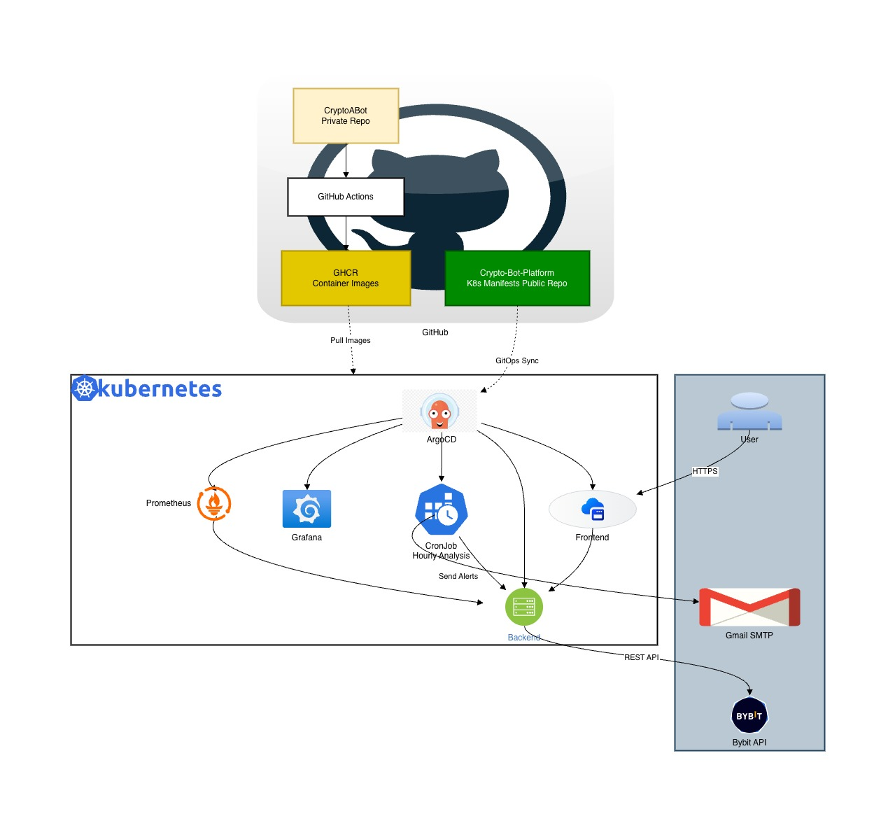

# Crypto Trading Bot Platform

A GitOps-based Kubernetes platform for automated cryptocurrency trading analysis and alerts.



## Table of Contents

- [Overview](#overview)
- [Architecture](#architecture)
- [Features](#features)
- [Tech Stack](#tech-stack)
- [Repository Structure](#repository-structure)
- [Prerequisites](#prerequisites)
- [Deployment](#deployment)
- [Configuration](#configuration)
- [Accessing Services](#accessing-services)
- [Troubleshooting](#troubleshooting)
- [Issues Encountered & Solutions](#issues-encountered--solutions)
- [Contributing](#contributing)

---

## Overview

This platform automatically analyzes cryptocurrency markets every hour and sends email alerts when BUY or SELL signals are detected. It uses a GitOps approach with ArgoCD for continuous deployment.

**Analyzed Tokens:** BTC, ETH, SOL, BNB, DOGE, STABLEUSDT

---

## Architecture

The platform consists of two repositories:

| Repository | Type | Description |
|------------|------|-------------|
| **CryptoABot** | Private | Source code (FastAPI backend + React frontend) |
| **Crypto-Bot-Platform** | Public | Kubernetes manifests, Terraform, ArgoCD configurations |


### Components

- **Frontend**: React application for viewing trading signals
- **Backend**: FastAPI service fetching data from Bybit API
- **CronJob**: Hourly analysis of 6 tokens, sends email alerts
- **Monitoring**: Prometheus + Grafana stack
- **Ingress**: Traefik with host-based routing

---

## Features

- **Hourly Analysis**: Automated analysis of 6 cryptocurrency pairs
- **Email Alerts**: BUY/SELL signals sent via Gmail SMTP
- **Monitoring**: Full observability with Prometheus & Grafana
- **GitOps**: Automatic deployments via ArgoCD
- **Private Registry**: Secure image storage in GHCR

---

## Tech Stack

| Component | Technology |
|-----------|------------|
| Container Orchestration | K3s (Lightweight Kubernetes) |
| GitOps | ArgoCD |
| Ingress Controller | Traefik |
| Monitoring | Prometheus + Grafana |
| Infrastructure | Terraform |
| CI/CD | GitHub Actions |
| Container Registry | GitHub Container Registry (GHCR) |
| VPS Provider | Contabo |
| Data Source | Bybit API |


## Prerequisites

- Contabo VPS (or any Ubuntu 24.04 server)
- GitHub account with GHCR access
- Gmail account with App Password
- Domain or use sslip.io for dynamic DNS

---

## Deployment

### 1. Set GitHub Secrets

Add these secrets to your repository:

| Secret | Description |
|--------|-------------|
| `SSH_PRIVATE_KEY` | SSH key for VPS access |
| `VPS_IP` | Your VPS IP address |
| `CONTABO_CLIENT_ID` | Contabo API client ID |
| `CONTABO_CLIENT_SECRET` | Contabo API secret |
| `GHCR_USERNAME` | GitHub username |
| `GHCR_TOKEN` | GitHub PAT with `packages:read` |

### 2. Bootstrap Infrastructure

Push to `main` branch to trigger Terraform:

```bash
git push origin main
```

This will:
- Install K3s on the VPS
- Install Helm
- Deploy ArgoCD
- Create GHCR pull secret
- Apply the root ArgoCD application

### 3. Create Kubernetes Secrets

SSH into your VPS and create the required secrets:

```bash
# Email credentials for CronJob alerts
kubectl create secret generic email-credentials \
  --from-literal=smtp-host=smtp.gmail.com \
  --from-literal=smtp-port=465 \
  --from-literal=smtp-user=your-email@gmail.com \
  --from-literal='smtp-pass=your-app-password' \
  --from-literal='email-to=recipient1@gmail.com,recipient2@gmail.com'

# Grafana admin credentials
kubectl create secret generic grafana-admin-credentials \
  --namespace monitoring \
  --from-literal=admin-user=admin \
  --from-literal=admin-password=your-secure-password
```

### 4. Add Helm Repository to ArgoCD

```bash
kubectl apply -f - <<EOF
apiVersion: v1
kind: Secret
metadata:
  name: prometheus-community-helm
  namespace: argocd
  labels:
    argocd.argoproj.io/secret-type: repository
stringData:
  name: prometheus-community
  url: https://prometheus-community.github.io/helm-charts
  type: helm
EOF
```

---

## Configuration

### Adding More Tokens

Edit `manifests/bot/analyzer-script.yaml`:

```yaml
TOKENS="BTCUSDT ETHUSDT SOLUSDT BNBUSDT DOGEUSDT XRPUSDT"
```

### Adding More Email Recipients

Update the secret:

```bash
kubectl delete secret email-credentials
kubectl create secret generic email-credentials \
  --from-literal=smtp-host=smtp.gmail.com \
  --from-literal=smtp-port=465 \
  --from-literal=smtp-user=your-email@gmail.com \
  --from-literal='smtp-pass=your-app-password' \
  --from-literal='email-to=user1@gmail.com,user2@gmail.com,user3@gmail.com'
```

### Changing CronJob Schedule

Edit `manifests/bot/cronjob.yaml`:

```yaml
spec:
  schedule: "0 * * * *"  # Every hour
  # schedule: "*/30 * * * *"  # Every 30 minutes
  # schedule: "0 */4 * * *"   # Every 4 hours
```

---

## Accessing Services

| Service | URL |
|---------|-----|
| Frontend | `http://YOUR_VPS_IP.sslip.io` |
| Grafana | `http://grafana.YOUR_VPS_IP.sslip.io` |
| Prometheus | `http://prometheus.YOUR_VPS_IP.sslip.io` |
| ArgoCD | `http://argocd.YOUR_VPS_IP.sslip.io` |

### ArgoCD Initial Password

```bash
kubectl -n argocd get secret argocd-initial-admin-secret -o jsonpath="{.data.password}" | base64 -d
```

---

## Troubleshooting

### Check ArgoCD Applications

```bash
kubectl get applications -n argocd
```

### Force ArgoCD Sync

```bash
kubectl patch application root -n argocd --type merge -p '{"metadata": {"annotations": {"argocd.argoproj.io/refresh": "hard"}}}'
```

### Test CronJob Manually

```bash
kubectl create job --from=cronjob/trading-bot-cron test-run
kubectl logs -f job/test-run
```

### Check Pod Logs

```bash
kubectl logs -f deployment/trading-bot
kubectl logs -f deployment/frontend
```

### Restart Deployments

```bash
kubectl rollout restart deployment/trading-bot
kubectl rollout restart deployment/frontend
```

---

## Issues Encountered & Solutions

### Issue 1: 404 Page Not Found on Grafana, Prometheus, ArgoCD

**Problem:** All monitoring UIs returned 404 errors.

**Root Cause:** Ingress configuration mismatch:
- Ingresses used path-based routing (`/grafana`, `/prometheus`) without host field
- Applications were configured for host-based routing in values.yaml
- Service names didn't match Helm release naming convention

**Solution:**
```yaml
# BEFORE (Wrong)
rules:
  - http:
      paths:
        - path: /grafana
          backend:
            service:
              name: monitoring-grafana

# AFTER (Correct)
rules:
  - host: grafana.YOUR_VPS_IP.sslip.io
    http:
      paths:
        - path: /
          backend:
            service:
              name: monitoring-stack-grafana
```

---

### Issue 2: Monitoring Stack Not Deployed

**Problem:** `kubectl get svc -n monitoring` returned "No resources found"

**Root Cause:** Only ingresses were being deployed, not the actual Prometheus/Grafana stack.

**Solution:** Added Helm-based ArgoCD Application for kube-prometheus-stack:

```yaml
apiVersion: argoproj.io/v1alpha1
kind: Application
metadata:
  name: monitoring-stack
spec:
  source:
    repoURL: https://prometheus-community.github.io/helm-charts
    chart: kube-prometheus-stack
    targetRevision: 67.4.0
```

---

### Issue 3: ArgoCD Helm Repository Not Found

**Problem:** monitoring-stack application stuck with no sync status.

**Root Cause:** ArgoCD didn't have the Prometheus Helm repository registered.

**Solution:**
```bash
kubectl apply -f - <<EOF
apiVersion: v1
kind: Secret
metadata:
  name: prometheus-community-helm
  namespace: argocd
  labels:
    argocd.argoproj.io/secret-type: repository
stringData:
  name: prometheus-community
  url: https://prometheus-community.github.io/helm-charts
  type: helm
EOF
```

---

### Issue 4: CRD Annotation Too Long Error

**Problem:** monitoring-stack showed "OutOfSync" with error:
```
CustomResourceDefinition is invalid: metadata.annotations: Too long: may not be more than 262144 bytes
```

**Root Cause:** kube-prometheus-stack CRDs exceed Kubernetes annotation limits when using client-side apply.

**Solution:** Enable server-side apply in ArgoCD:
```yaml
syncPolicy:
  syncOptions:
    - ServerSideApply=true
```

---

### Issue 5: ArgoCD Bad Gateway Error

**Problem:** ArgoCD UI returned 502 Bad Gateway.

**Root Cause:** ArgoCD server runs HTTPS internally, but ingress was configured for HTTP.

**Solution:** Configure ArgoCD to run in insecure mode:

1. Create ConfigMap:
```yaml
apiVersion: v1
kind: ConfigMap
metadata:
  name: argocd-cmd-params-cm
  namespace: argocd
data:
  server.insecure: "true"
```

2. Restart ArgoCD server:
```bash
kubectl rollout restart deployment argocd-server -n argocd
```

---

### Issue 6: CronJob Not Sending Emails

**Problem:** CronJob ran but emails weren't sent; signal parsing returned empty.

**Root Cause:** 
1. API parameter was `interval` not `timeframe`
2. Signal was nested as `signal.bias` not `signal`
3. API expected `interval=60` for 1-hour candles, not `1h`

**Solution:** Updated analyzer script:
```bash
# BEFORE (Wrong)
curl "$API_URL/api/analyze?symbol=$TOKEN&timeframe=1h"
SIGNAL=$(echo "$RESPONSE" | grep -o '"signal":"[^"]*"')

# AFTER (Correct)
curl "$API_URL/api/analyze?symbol=$TOKEN&interval=60"
BIAS=$(echo "$RESPONSE" | grep -o '"bias":"[^"]*"' | head -1 | cut -d'"' -f4)
```

---

### Issue 7: ArgoCD Ingress Not Deployed

**Problem:** `kubectl get ingress -n argocd` returned "No resources found"

**Root Cause:** No ArgoCD Application was pointing to `manifests/argocd` path.

**Solution:** Created `apps/argocd-ingress.yaml`:
```yaml
apiVersion: argoproj.io/v1alpha1
kind: Application
metadata:
  name: argocd-ingress
  namespace: argocd
spec:
  source:
    repoURL: https://github.com/Terabyite/Crypto-Bot-Platform.git
    path: manifests/argocd
```

---

### Issue 8: Grafana Password Unknown

**Problem:** Couldn't log into Grafana; password was set in plaintext in values.yaml.

**Root Cause:** Hardcoding secrets in Git is a security risk.

**Solution:** Use Kubernetes Secret with `existingSecret`:
```yaml
grafana:
  admin:
    existingSecret: grafana-admin-credentials
    userKey: admin-user
    passwordKey: admin-password
```

Then create secret on cluster:
```bash
kubectl create secret generic grafana-admin-credentials \
  --namespace monitoring \
  --from-literal=admin-user=admin \
  --from-literal=admin-password=your-password
```

---

### Issue 9: CronJob YAML Validation Errors (Red Squiggly Lines)

**Problem:** IDE showed validation errors on heredoc content in cronjob.yaml.

**Root Cause:** YAML heredoc (`<<EOF`) content was being parsed as YAML instead of plain text.

**Solution:** Moved script to ConfigMap and mounted it:
```yaml
# analyzer-script.yaml (ConfigMap)
apiVersion: v1
kind: ConfigMap
metadata:
  name: analyzer-script
data:
  analyze.sh: |
    #!/bin/sh
    # Script content here...

# cronjob.yaml
volumes:
  - name: script
    configMap:
      name: analyzer-script
containers:
  - volumeMounts:
      - name: script
        mountPath: /scripts
    command: ["/bin/sh", "/scripts/analyze.sh"]
```

---

## 📄 License

MIT License - feel free to use this for your own projects!

---

## 🙏 Acknowledgments

- [ArgoCD](https://argoproj.github.io/cd/) for GitOps
- [K3s](https://k3s.io/) for lightweight Kubernetes
- [kube-prometheus-stack](https://github.com/prometheus-community/helm-charts) for monitoring
- [Bybit](https://bybit.com/) for market data API

---

**Created by Innocent** | 2026